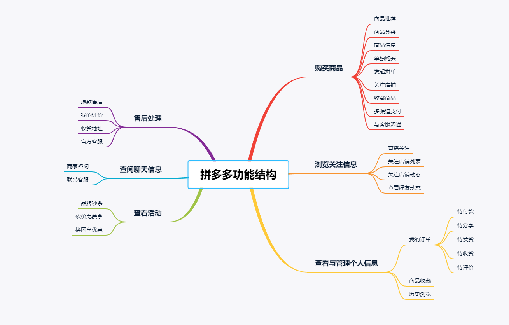
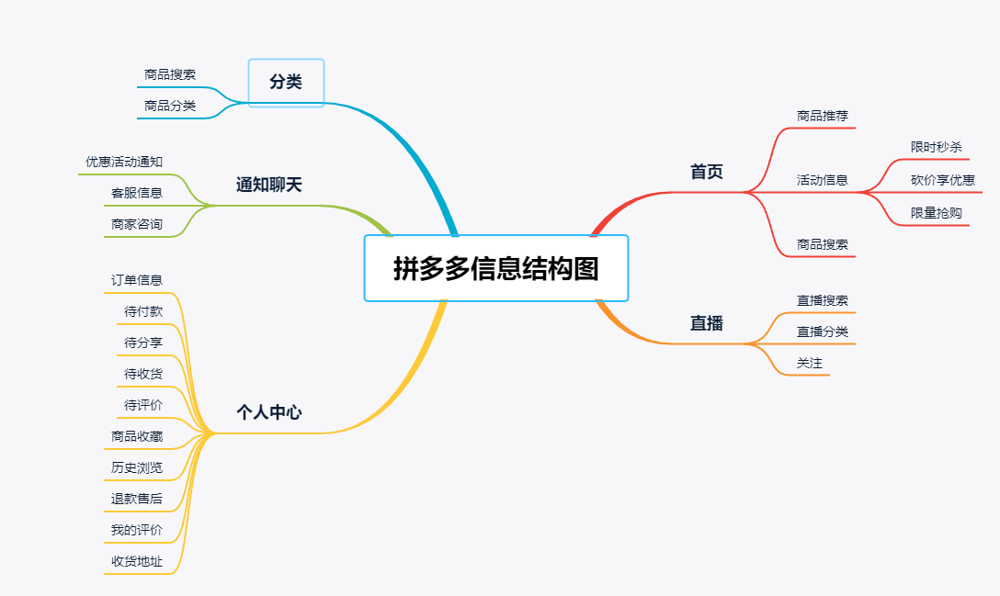
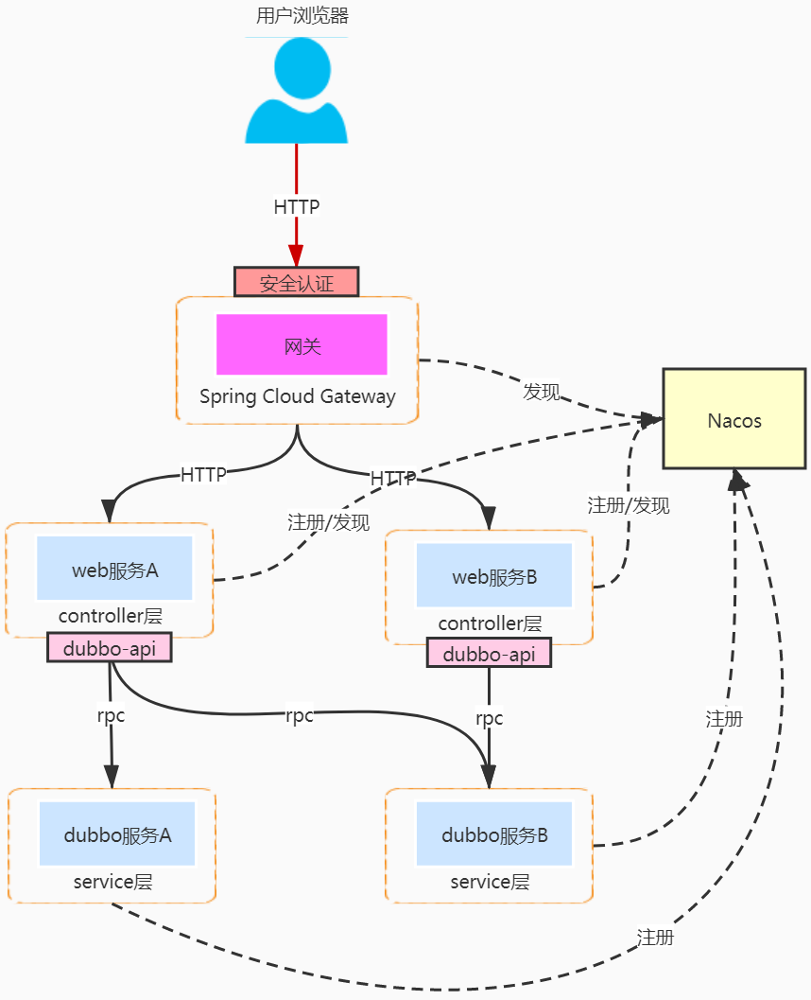
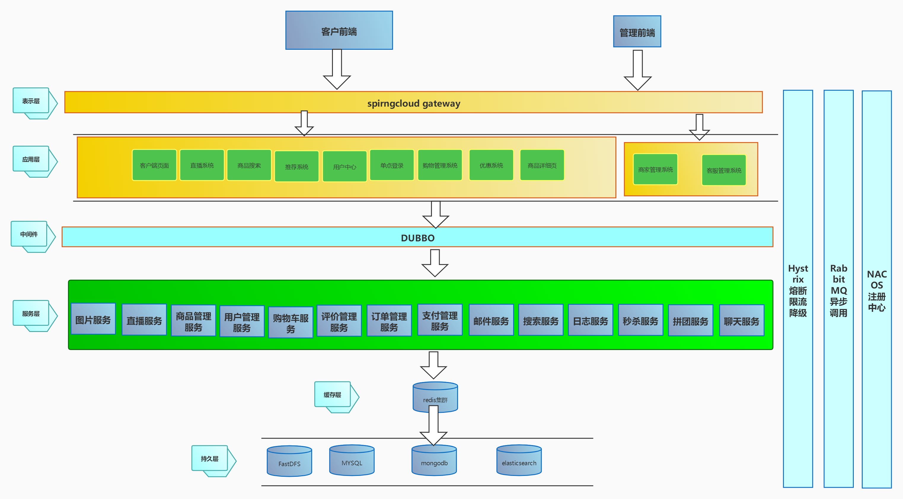

# 华农拼多多（部分功能实现测试版）

## 功能结构图

## 信息结构图

## 后端架构

## 项目结构

| 模块              | 名称             | 端口  | 说明                       |
| ----------------- | ---------------- | ----- | -------------------------- |
| admin-web         | 【前端】管理后台 | 8000  | 后台管理web端              |
| seller-web        | 【前端】商家后台 | 8001  | 商家后台控制web端          |
| user-web          | 【前端】用户页面 | 8002  | 用户页面web端              |
| promotion-app     | 优惠系统         | 8003  | 处理秒杀，拼团请求         |
| product-app       | 商品信息系统     | 8004  | 处理商品详情，商品评价请求 |
| buy-app           | 支付系统         | 8005  | 处理订单支付请求           |
| sso-service       | 单点登录         | 8006  |                            |
| user-app          | 用户中心         | 8007  |                            |
| recommend-app     | 推荐系统         | 8008  |                            |
| search-app        | 商品搜索         | 8009  |                            |
| broadcast-app     | 直播系统         | 8010  |                            |
| picture-service   | 图片服务         | 8011  |                            |
| broadcast-service | 直播服务         | 8012  |                            |
| product-serivce   | 商品管理服务     | 8013  |                            |
| cart-servcie      | 购物车管理服务   | 20884 |                            |
| user-servcie      | 用户管理服务     | 20885 |                            |
| comment-service   | 评价服务         | 8016  |                            |
| order-service     | 订单服务         | 8017  |                            |
| pay-servcie       | 支付服务         | 8018  |                            |
| email-service     | 邮件服务         | 8019  |                            |
| search-service    | 搜索服务         | 80889 |                            |
| log-serivce       | 日志服务         | 8021  |                            |
| seckill-service   | 秒杀服务         | 8022  |                            |
| makegroup-servcie | 拼团服务         | 8023  |                            |
| chat-service      | 聊天服务         | 8024  |                            |

## 技术栈

### 后端

| 框架                | 说明                  | 版本 |
| ------------------- | --------------------- | ---- |
| SpringBoot          | 应用开发框架          | 2.2.10-RELEASE |
| SpringCloud Gateway | 微服务网关            |      |
| Druid               | JDBC 连接池、监控组件 |      |
| Mybatis             | 数据持久层框架        |      |
| Redis               | key-value 数据库      |      |
| Elasticsearch       | 分布式搜索引擎        |      |
| Dubbo               | 分布式 RPC 服务框架   |      |
| RabbitMQ            | 消息中间件            |      |
| NACOS               | 分布式系统协调        |      |
| MYSQL               | 关系数据库            |      |
| MongoDB             | 非关系数据库          |      |

### 前端

| 框架              | 说明              | 版本    |
| ----------------- | ----------------- | ------- |
| Vue.js            | web前端渐近式框架 | 2.X     |
| vant有赞          | 移动端Vue组件库   | 2.10.13 |
| vue-element-admin | 后台前端解决方案  | v4.1.0+ |
| vue-cli + webpack | 工程化脚手架      |         |
